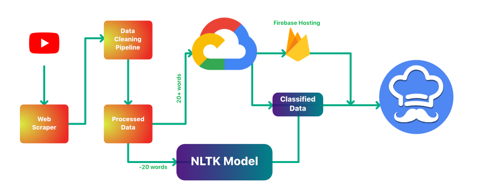

#  ReplyChef

[Try it out!](https://replychef.tech)
 
[Watch the demo](https://youtu.be/A4xAyQkeIHU)

## Meet the Team

 |  |  | 
-- | -- | -- | --
Francisco | Jackson | Ryan | Ethan

## Inspiration

As we move further into a digital age interacting with your audience is increasingly important. This is true especially if you're any form of content creator or manage an online business. In almost every medium of online creativity there is a space for people to leave comments. These comments can grow quickly, leaving the frustrated creator in a spot where engagement feels overwhelming. But what if you could change that? What if you coud use machine learning and natural language processing to serve you comments in your feed? Or present relevant forums to the content and questions people have, or even group comments by sentiment? Enter, ReplyChef.

## How we built it

## Technologies Used
- Python 3, NumPy, Pandas, Scikit-learn
- Google Nautral Language API, Natural Language Toolkit
- Google Cloud Platform, Firebase
- React, Javascript

## Challenges faced
- Google Cloud's NLP API only classifies strings with less than 20 words. We solved this challenge by devloping our own classification model using NLTK in order to classify the non-compliant data.
- YouTube API only allows comments to be pulled after verification with OAuth. To get around this, we used a webscraping bot to pull thousands of comments for training the model.
- Typical machine learning models used for classification, such as logistic regression, were not effective for our dataset. After some experimentation, we determined that a multinomial naive bayes classification model had the best performance. Using multiclass logloss as a metric, this model even outperformed popular modern ensemble models such as XGBoost.

## Project Features
- Classification of comments by category.
- Creator replies.

## Future Implementations
- Integrate OAuth.
- Allow users to select a video for classification.
- Send comment replies to YouTube API.
- Use Google Cloud Functions to run model on backend in real time.
